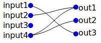

# routes-panel-component

routes-panel-component is a custom HTML element built with [Web Components](https://developer.mozilla.org/en-US/docs/Web/Web_Components)
technologies. It provides a simple interface to connect inputs with outputs. It
can be mostly useful to handle data streams or to provide a GUI component for
signal processing utilities.

The routes-panel-component itself is made of a figure element containing one
canvas, where routes are drawn as Bézier curves, surrounded by two lists. The
user can create routes by clicking, right-click removes routes. Either dots or
labels may be clicked.

A minimalist routes-panel component looks like this :



To use this custom element, the routes-panel module must be called :
```html
<script type="module" src="routes-panel.js" async defer></script>
```
This makes the `<routes-panel>` tag available for the document. Inputs and
outputs can be defined with `inputs` and `outputs` attributes, comma-separated:
```html
<routes-panel inputs="input1,input2,input3,input4" outputs="out1,out2,out3">
</routes-panel>
```
When the user creates or removes routes, the element is updated with a `routes`
attribute, containing routes created by the user, separated by a pipe `|`, where
inputs and matching outputs are connected by a dash `-`:
```html
<routes-panel
  inputs="input1,input2,input3,input4"
  outputs="out1,out2,out3"
  routes="input4-out2|input1-out3|input2-out1|input4-out1">
</routes-panel>
```
Routes can be given a default state by setting the `routes` attribute when
creating the element.